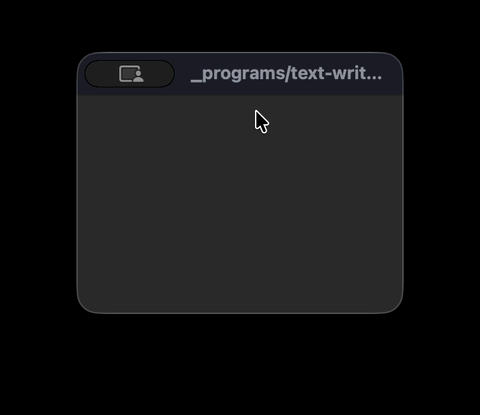

# Simple Computer

> What if you had to build a computer starting from a single wire?

This project does exactly that — a working 16-bit computer simulated in Go, built layer by layer from NAND gates all the way up to a CPU that runs real programs.

It's not a tutorial. It's a hands-on answer to the question: *how does a computer actually work?*



---

## What it is

A complete simulation of the CPU described in [_But How Do It Know?_](http://buthowdoitknow.com/) by J. Clark Scott.

- **16-bit architecture**, 65K RAM, 4 registers
- **240×160 display** rendered with OpenGL
- **Keyboard input** support
- A custom **assembler** to write programs for it
- Built from scratch — wires → gates → components → CPU → computer

The full build story is documented in an 18-part blog series. _[link]_

This is a rewrite of [djhworld/simple-computer](https://github.com/djhworld/simple-computer), rebuilt from the ground up as a learning exercise.

---

## Run the demo

**1. Build**

```bash
make
```

**2. Pick a program and run it**

```bash
# Interactive text editor
./bin/simulator -bin _programs/text-writer.bin

# Pixel drawing canvas
./bin/simulator -bin _programs/brush.bin

# ASCII character table
./bin/simulator -bin _programs/ascii.bin
```

A window opens showing the 240×160 display. Keyboard input goes straight to the running program.

---

## How it's built

Every component in this project is assembled from the one below it — no shortcuts:

```
NAND gate
  └─ Logic gates (AND, OR, NOT, XOR...)
       └─ Storage (flip-flops, registers)
            └─ Bus, ALU, decoder, stepper
                 └─ CPU (fetch → decode → execute)
                      └─ Computer (CPU + 64K RAM + display + keyboard)
                           └─ Assembler + programs
```

The codebase mirrors this structure — each package builds on the one before it.

---

## Write your own programs

Write assembly, assemble, run:

```bash
./bin/assembler -i my-program.asm -o my-program.bin
./bin/simulator -bin my-program.bin
```

The instruction set covers the basics: `DATA`, `LOAD`, `ST`, `ADD`, `AND`, `OR`, `XOR`, `NOT`, `SHR`, `SHL`, `CMP`, `JMP`, `CALL`, `IN`, `OUT`. See `_programs/*.asm` for examples.

---

## Credits

- Original project: [djhworld/simple-computer](https://github.com/djhworld/simple-computer)
- Book: [_But How Do It Know?_](http://buthowdoitknow.com/) by J. Clark Scott
